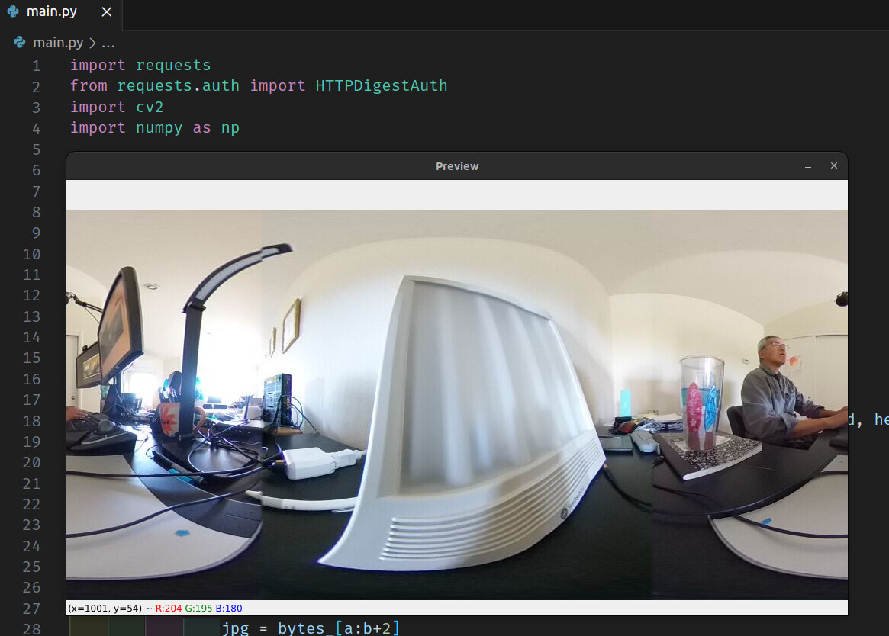

# RICOH THETA OpenCV MJPEG Stream over WiFi

author : [Robert Katter](https://community.theta360.guide/u/katterr)

This is a copy of Robert Katter's script from the theta360.guide community
forum. [Original post](https://community.theta360.guide/t/preview-mjpeg-stream-on-a-ricoh-theta-x-with-python-and-opencv/8919?u=craig)

The image below is from Robert Katter.



## Overview

Use Python to view a motionjpeg stream in equirectangular format from RICOH
THETA cameras.  This example uses OpenCV.

## Usage

1. connect camera in client mode
1. change information below to the IP address and serial number of your camera
1. if using pipenv, run:

```text
pipenv install
pipenv shell
python main.py
```

Refer to code and change lines below

```python
url = http://[Camera IP Address]/osc/commands/execute
username = "CameraSerialNumber"
password = "DigitsOnlyofCameraSerialNumber"

# example information
# url = 'http://192.168.2.101/osc/commands/execute'
# username = "THETAYL00105377"
# password = "00105377"
```
